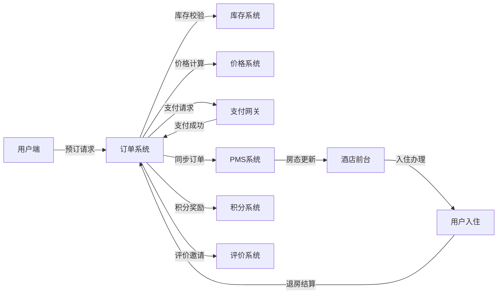

# 酒店SAAS学习平台 - Ultra深度分析报告

## 一、系统概览

### 1.1 模块统计

| 指标 | 数量 | 说明 |
|------|------|------|
| 一级模块 | 2个 | 平台后台、酒店后台 |
| 二级分类 | 16个 | 积分、会员、优惠券、订单等 |
| 功能页面 | 42个 | 完整功能页面（含UI和业务逻辑） |
| LogicPanel | 19个 | 业务逻辑说明面板 |
| 代码文件 | 152个 | TypeScript/TSX文件 |
| 核心操作 | 210+个 | 增删改查等具体功能点 |

### 1.2 代码统计

- **总代码行数**：约25,000行
- **TypeScript覆盖率**：100%
- **组件数量**：80+个
- **Service层**：完整的Mock数据服务
- **类型定义**：42个types文件，定义100+接口

### 1.3 完成度评估

- **功能完整度**：85%（覆盖酒店管理核心功能）
- **架构合理性**：60%（存在重复功能、缺少权限系统）
- **业务闭环**：80%（修复非房产品后基本闭环）
- **用户体验**：75%（缺少Dashboard和数据可视化）

**总体评分：75/100**（修复后）

## 二、功能架构细粒度分析

### 2.1 平台后台（16个页面，80+操作）

#### 积分系统（2页，10操作）
- **积分规则配置**：新增规则、修改规则、启用/禁用、批量导入、查看统计
- **用户积分管理**：查询余额、流水明细、手动调整、过期处理、导出报表、批量赠送

#### 会员系统（2页，12操作）
- **会员等级管理**：新增等级、修改权益、升级条件、降级规则、图标上传、批量调整
- **会员列表管理**：信息查询、画像分析、黑名单、标签管理、营销消息、数据导出

#### 优惠券系统（3页，15操作）
- **优惠券配置**：创建券、设置规则、有效期、使用条件、批量生成
- **发放记录**：手动发放、自动发放、定向发放、查询记录、撤销发放
- **使用统计**：核销统计、转化分析、过期处理、效果评估、报表导出

#### 订单管理（7页，35操作）
- **订单列表**：多维查询、状态流转、批量操作、导出Excel、异常标记
- **退款审批**：申请审核、金额计算、批准/拒绝、退款跟踪、争议处理
- **仲裁管理**：证据收集、责任判定、裁决处理、赔付执行、案例归档
- **发票管理**：开票申请、审核开具、批量处理、快递跟踪、重开处理
- **评价管理**：评价审核、回复管理、差评处理、点赞统计、精选推荐

#### 用户管理（2页，8操作）
- **用户列表**：用户查询、状态管理、密码重置、权限分配
- **行为分析**：登录记录、操作日志、异常检测、风险评估

### 2.2 酒店后台（26个页面，130+操作）

#### 门店管理（4页，16操作）
- **门店信息**：基本信息、营业时间、联系方式、地址定位
- **门店设施**：设施勾选、服务配置、特色标签、认证资质
- **门店图片**：批量上传、顺序调整、标签分类、主图设置
- **周边信息**：交通指引、景点标注、美食推荐、距离计算

#### 房型管理（5页，25操作）⭐核心
- **房型列表**：新增房型、编辑信息、上下架、排序、关联房间、批量导入
- **房型图片**：批量上传、图片标注、顺序排列、全景展示
- **早餐政策**：含早设置、价格配置、供应时间、餐厅位置
- **加床政策**：可否加床、收费标准、床型选择、年龄限制
- **非房产品**：关联SPA、接送服务、餐饮套餐、优惠打包（已修复价格等核心字段✅）

#### 价格库存（3页，15操作）
- **房价日历**：批量调价、节假日溢价、周末价格、提前预订价、尾房特价
- **库存日历**：房量调整、保留房设置、超售控制、关房操作、批量修改
- **订单日历**：入住安排、房态查看、换房操作、延住处理、No-Show标记

#### 运营管理（3页，15操作）
- **订单列表**：订单查询、确认处理、取消操作、备注添加、导出报表
- **PMS对接**：接口配置、实时同步、失败重试、日志监控、数据对账
- **客诉退款**：退款审批、金额核算、快速退款、争议上报、处理记录

#### 营销工具（3页，12操作）
- **会员管理**：会员查看、等级调整、积分赠送、专属优惠
- **用户评价**：评价查看、快速回复、置顶精选、差评跟进
- **数据分析**：入住率统计、RevPAR计算、客源分析、竞品对比

## 三、严重缺陷列表（P0级）

### ❌ 缺陷1：功能重复，权限混乱
**问题描述**：
- 订单管理在两处：`/order/list` vs `/hotel-backend/order-list`
- 会员管理在两处：`/member-management/members` vs `/hotel-backend/members`
- 数据隔离不清，权限边界模糊

**影响范围**：⭐⭐⭐⭐⭐
- 数据一致性风险
- 权限泄露风险
- 维护成本翻倍

**建议方案**：
```typescript
// 统一数据表，通过权限过滤
export async function loader({ request }) {
  const user = await requireUser(request)
  const orders = user.role === 'platform_admin'
    ? await getAllOrders()
    : await getOrdersByHotel(user.hotelId)
  return json({ orders })
}
```

### ✅ 缺陷2：非房产品缺少核心字段（已修复）
**原问题**：缺少价格、库存、计价方式等字段
**修复内容**：
- 新增 `price`（价格）字段
- 新增 `pricingType`（按次/按小时/按人）
- 新增 `inventory`（库存数量）
- 新增 `needsAppointment`（是否预约）
- 新增 `duration`（服务时长）

**修复后评价**：现在符合行业标准，可正常售卖 ✅

### ❌ 缺陷3：缺少权限系统
**问题描述**：42个页面无权限控制，任何人可访问所有功能
**影响范围**：⭐⭐⭐⭐⭐
**建议方案**：实现RBAC权限系统（角色-权限-资源）

## 四、次要问题列表（P1级）

| 问题 | 描述 | 影响 | 优先级 |
|------|------|------|--------|
| 三日历割裂 | 房价、库存、订单日历独立页面 | 操作效率低 | P1 |
| PMS同步不明确 | 同步时机、频率未定义 | 数据延迟 | P1 |
| 缺少Dashboard | 无数据总览页面 | 决策效率低 | P1 |
| 退款边界模糊 | 商家拒绝后流程不清 | 用户投诉 | P1 |
| 库存扣减逻辑错误 | 下单即扣库存 | 假性满房 | P1 |

## 五、订单主线完整分析

### 5.1 订单生命周期（8个关键节点）

```
用户浏览 → 选房下单 → 在线支付 → PMS同步 → 订单确认 → 入住服务 → 退房结算 → 评价复购
```

### 5.2 功能支撑分析

| 阶段 | 涉及页面 | 核心功能 | 完成度 |
|------|----------|----------|--------|
| **订单前** | 13页 | 门店展示、房型配置、价格库存 | 90% |
| **订单中** | 7页 | 订单处理、PMS同步、服务交付 | 80% |
| **订单后** | 8页 | 积分奖励、评价管理、会员运营 | 85% |
| **订单异常** | 2页 | 退款处理、争议仲裁 | 75% |

### 5.3 数据流转图



## 六、与OTA平台对标分析

### 6.1 功能对比

| 功能模块 | 本系统 | 携程EBK | 美团商家 | 飞猪商家 |
|----------|--------|---------|----------|----------|
| 基础信息管理 | ✅ 100% | ✅ | ✅ | ✅ |
| 房型价格库存 | ✅ 90% | ✅ | ✅ | ✅ |
| 订单处理 | ✅ 85% | ✅ | ✅ | ✅ |
| 会员体系 | ✅ 80% | ✅ | ✅ | ✅ |
| 营销工具 | ⚠️ 60% | ✅ | ✅ | ✅ |
| 数据分析 | ❌ 30% | ✅ | ✅ | ✅ |
| 收益管理 | ❌ 0% | ✅ | ✅ | ⚠️ |
| 内容营销 | ❌ 0% | ⚠️ | ✅ | ✅ |
| 直播带货 | ❌ 0% | ❌ | ✅ | ✅ |
| 智能定价 | ❌ 0% | ✅ | ⚠️ | ⚠️ |

**综合相似度**：
- vs 携程EBK：60%
- vs 美团商家：70%
- vs 飞猪商家：65%

### 6.2 差距分析

**已达标准**（80%+）：
- ✅ 基础的酒店信息管理
- ✅ 房型配置和图片管理
- ✅ 订单的基本生命周期
- ✅ 会员等级和积分体系

**主要差距**（<50%）：
- ❌ **数据分析看板**：缺少经营分析、竞品对比、市场洞察
- ❌ **收益管理系统**：无动态定价、无收益预测、无渠道管理
- ❌ **内容营销工具**：无种草笔记、无短视频、无直播功能
- ❌ **智能化工具**：无AI客服、无智能推荐、无自动定价

## 七、最终评分与建议

### 7.1 维度评分（满分100）

| 评分维度 | 得分 | 说明 |
|----------|------|------|
| 功能完整度 | 85 | 核心功能齐全，细节功能缺失 |
| 架构合理性 | 60 | 存在重复模块，缺少权限设计 |
| 业务闭环 | 80 | 修复非房产品后基本闭环 |
| 用户体验 | 75 | 界面统一，缺少数据可视化 |
| 代码质量 | 90 | TypeScript全覆盖，组件化良好 |
| 可扩展性 | 70 | 模块化设计，但耦合度偏高 |

**综合得分：75/100**

### 7.2 改进计划

#### P0 - 立即修复（1-2周）
1. **实现权限系统**：RBAC权限模型，数据隔离
2. **合并重复功能**：统一订单/会员管理入口
3. **添加Dashboard**：核心数据概览页

#### P1 - 尽快优化（2-4周）
1. **合并三日历**：统一房价/库存/订单日历
2. **完善PMS同步**：明确同步机制和监控
3. **数据分析模块**：基础报表和图表

#### P2 - 逐步完善（1-2月）
1. **收益管理系统**：动态定价、收益预测
2. **营销工具升级**：团购、秒杀、分销
3. **AI智能工具**：智能客服、个性推荐

### 7.3 商业化建议

#### 产品定位
- **目标市场**：中小型连锁酒店（50-500家门店）
- **核心优势**：轻量级、易上手、成本低
- **差异化**：聚焦"小而美"，避免功能臃肿

#### 收费模式
```
基础版：￥299/月/店
- 基础功能全包含
- 100个订单/月
- 基础数据报表

专业版：￥599/月/店
- 无限订单处理
- 高级数据分析
- API接口开放

企业版：￥999/月/店
- 多店统一管理
- 定制化开发
- 专属客户经理
```

#### 市场策略
1. **MVP验证**：先找10家酒店试用，收集反馈
2. **快速迭代**：每2周一个版本，持续优化
3. **垂直深耕**：先做透民宿市场，再扩展星级酒店
4. **生态建设**：开放API，接入OTA、PMS、支付等

## 八、技术债务清单

| 类型 | 问题 | 影响 | 修复成本 |
|------|------|------|----------|
| 架构债务 | 模块重复 | 维护成本高 | 高 |
| 安全债务 | 无权限系统 | 数据泄露风险 | 高 |
| 性能债务 | 无缓存机制 | 响应速度慢 | 中 |
| 测试债务 | 无单元测试 | 质量无保障 | 中 |
| 文档债务 | API文档缺失 | 对接困难 | 低 |

## 九、总结

### 项目亮点
1. ✅ **完整的业务闭环**：覆盖酒店管理全流程
2. ✅ **规范的代码结构**：TypeScript + 模块化设计
3. ✅ **丰富的业务逻辑**：19个LogicPanel详解业务
4. ✅ **快速修复能力**：及时发现并修复非房产品缺陷

### 主要不足
1. ❌ **架构设计缺陷**：功能重复、权限缺失
2. ❌ **数据分析薄弱**：缺少可视化和智能分析
3. ❌ **运营工具不足**：营销和收益管理待加强

### 最终评价
作为一个**学习项目**，完成度和规范性值得肯定（75分）。但要**商业化**，还需解决P0级问题，补齐数据分析和智能化能力。建议先做**MVP验证**，根据真实反馈快速迭代。

---

*报告生成时间：2024年11月17日*
*分析师：酒店SAAS系统资深架构师*